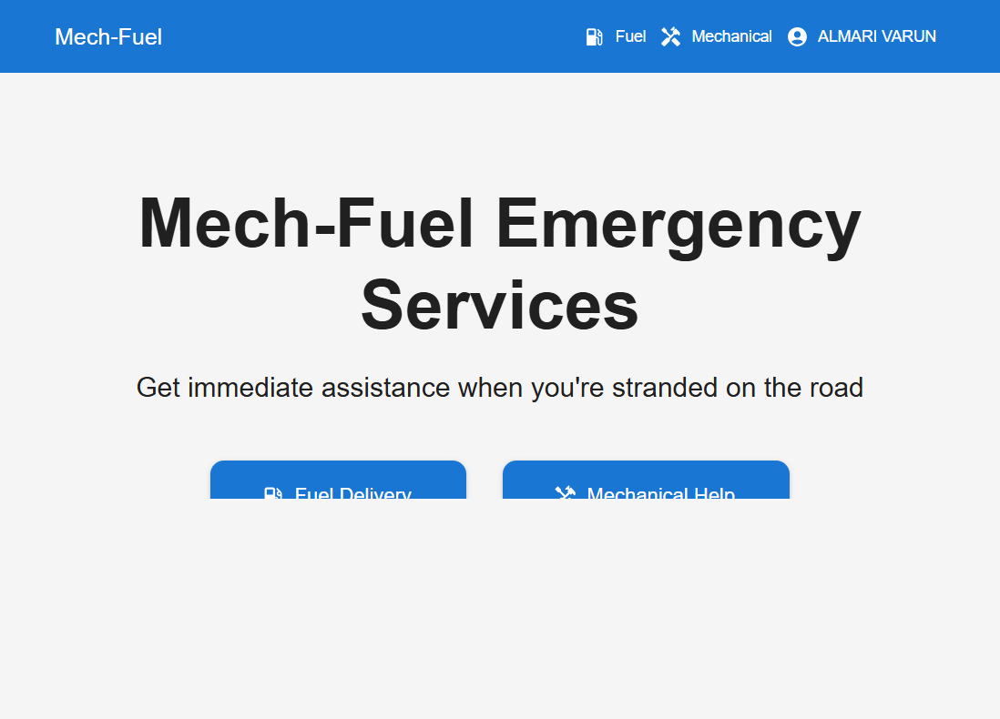
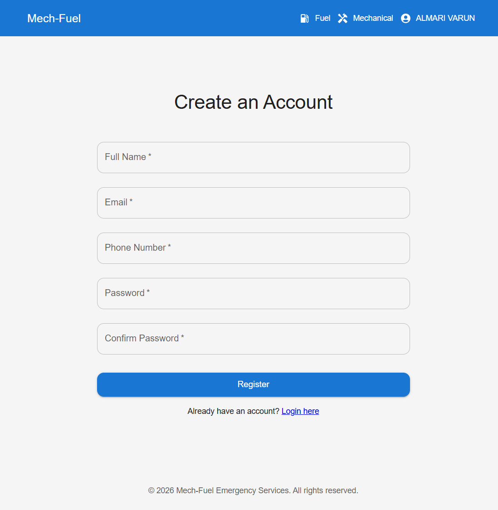
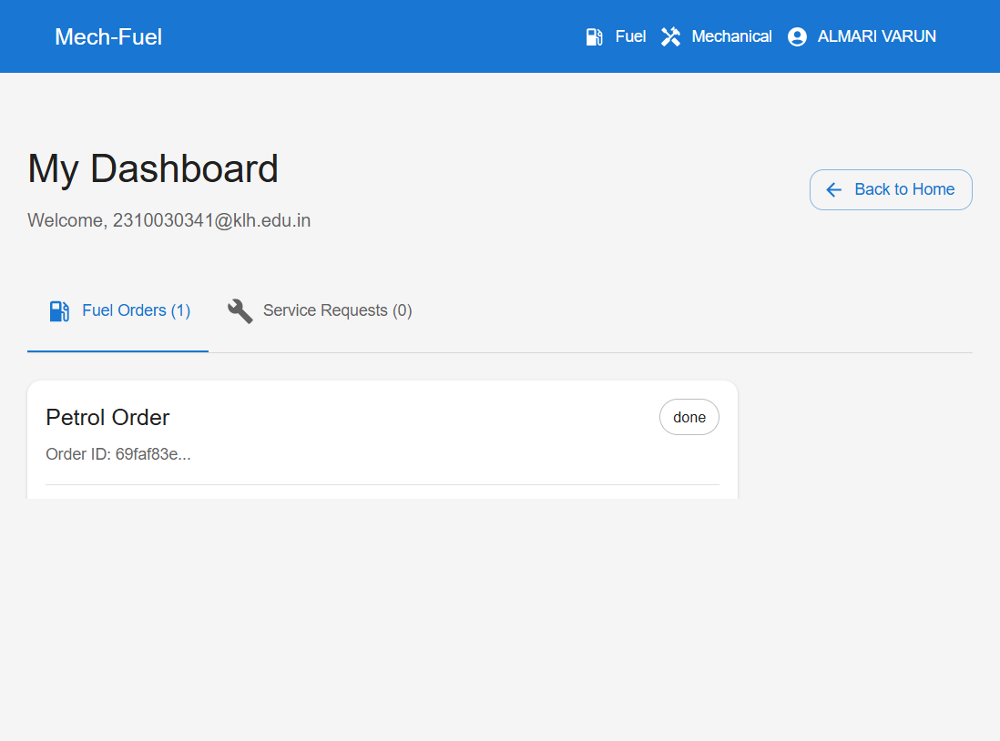

# Mech-Fuel

Mech-Fuel is a full-stack emergency roadside assistance platform built with the MERN stack. It lets users request fuel delivery or mechanical support, track requests, and manage their account from a responsive web app.

## What It Does

Mech-Fuel connects users with emergency road services in a simple, structured flow.

User features include fuel delivery orders, mechanical service requests, interactive location selection, request tracking, and account management.

Admin features include viewing and managing orders, monitoring users, and overseeing service requests from a central dashboard.

## Tech Stack

Frontend: React 19, Material UI, React Router DOM, React Leaflet, Fetch API, and Context API.

Backend: Node.js, Express.js, MongoDB with Mongoose, JWT auth, bcrypt, Helmet, and rate limiting.

## Architecture

The app uses a client-server architecture. The React frontend talks to the Express backend through REST APIs. JWT tokens protect authenticated routes, MongoDB stores user and service data, and backend middleware handles validation, error handling, authentication, and uploads.

## Screenshots

These screenshots are saved in `public/screenshots/` and can be used directly in GitHub or local previews.

### Home


### Register


### Dashboard


## Security

- JWT-based authentication
- Password hashing with bcrypt
- Protected frontend routes
- API rate limiting
- Secure headers with Helmet
- Backend input validation

## Project Structure

- `client/` React frontend
- `server/` Express backend

## How to Run

### Backend

```bash
cd server
npm install
```

Create `server/.env`:

```env
PORT=5001
MONGODB_URI=your_mongodb_connection
JWT_SECRET=your_secret_key
CORS_ORIGIN=http://localhost:3000
```

Start the backend:

```bash
npm run dev
```

### Frontend

```bash
cd client
npm install
npm start
```

## URLs

- Frontend: http://localhost:3000
- Backend: http://localhost:5001

## API Features

- User registration and login
- Fuel orders
- Mechanical service requests
- Admin order management
- Profile management
- Health check endpoint

## Author

Developed by Varun (varun77-nani)

## Purpose

This project demonstrates practical authentication, REST APIs, database integration, and frontend-backend communication in a real-world service platform.